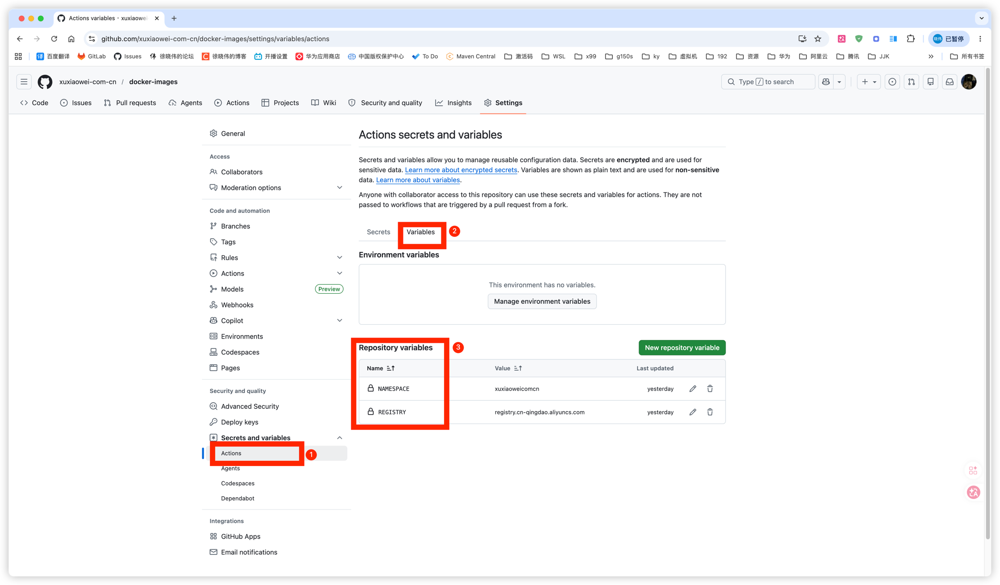
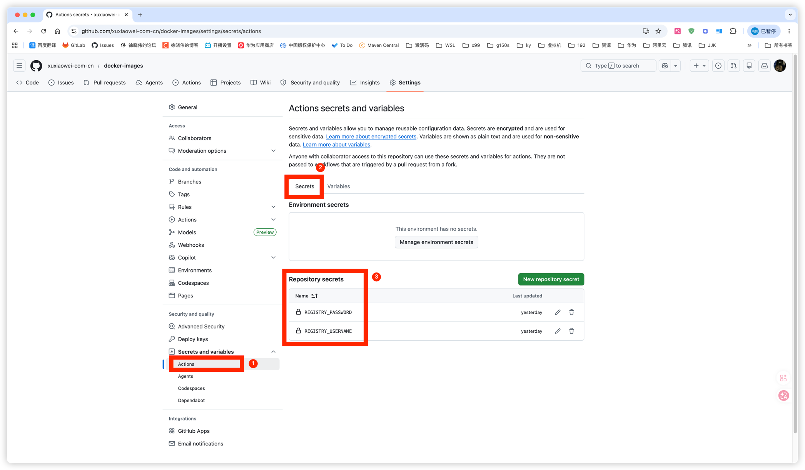

# Docker Images

将公共 Docker 镜像同步到私有仓库，自动处理多架构 manifest。

## 工作原理

根据分支名自动同步镜像：

- 从分支名解析源镜像和标签（格式：`{registry}/{image}:{tag}`）
- 自动检测源镜像支持的 CPU 架构
- 将各架构镜像分别推送到目标仓库
- 创建并推送多架构 manifest，统一引用

## 分支命名规范

```
{source_registry}/{image_path}/{tag}
```

例如：

```
docker.io/library/nginx/1.25
```

| 部分             | 示例值             |
|----------------|-----------------|
| 源仓库 (registry) | `docker.io`     |
| 镜像路径           | `library/nginx` |
| 标签             | `1.25`          |

## CI 流程

1. **matrix** — 检查源镜像，获取支持的 CPU 架构列表（过滤 unknown 架构）
2. **build** — 按架构逐个拉取、打标签、推送（`fail-fast: false`，单个架构失败不影响其他）
3. **merge** — 将所有架构合并为多架构 manifest 并推送

## 目标镜像名处理

由于部分目标仓库对镜像名有限制（如阿里云容器镜像仓库不允许出现 `/`），CI 会对目标镜像名做截取处理。

处理逻辑（参见 `.github/workflows/docker.yml` 第 47 行）：

```bash
NAME="${GITHUB_REF_NAME%/*}"       # 去掉最后一个 / 及之后的内容 → 源镜像路径
TARGET_NAME="${NAME##*/}"          # 只保留最后一个 / 之后的部分 → 目标镜像名
TAG="${GITHUB_REF_NAME##*/}"       # 最后一个 / 之后的内容 → 标签
```

示例（分支名 `docker.io/library/nginx/1.25`）：

| 变量             | 值                                                            |
|----------------|--------------------------------------------------------------|
| `NAME`         | `docker.io/library/nginx`                                    |
| `TARGET_NAME`  | `nginx`                                                      |
| `TAG`          | `1.25`                                                       |
| `TARGET_IMAGE` | `registry.cn-qingdao.aliyuncs.com/xuxiaoweicomcn/nginx:1.25` |

即无论源镜像路径有多少层级（如 `library/nginx`、`prometheus-community/prometheus`），目标镜像名只保留最后一段，从而符合目标仓库的命名规则。

## 变量和密钥

### Variables

| 变量          | 说明     | 示例                               |
|-------------|--------|----------------------------------|
| `REGISTRY`  | 目标仓库地址 | registry.cn-qingdao.aliyuncs.com |
| `NAMESPACE` | 目标命名空间 | xuxiaoweicomcn                   |



### Secrets

| 密钥                  | 说明      |
|---------------------|---------|
| `REGISTRY_USERNAME` | 目标仓库用户名 |
| `REGISTRY_PASSWORD` | 目标仓库密码  |



## 使用方法

1. 在 GitHub 仓库设置中配置上述 Variables 和 Secrets
2. 创建符合命名规范的分支
3. 推送分支，CI 将自动同步镜像
